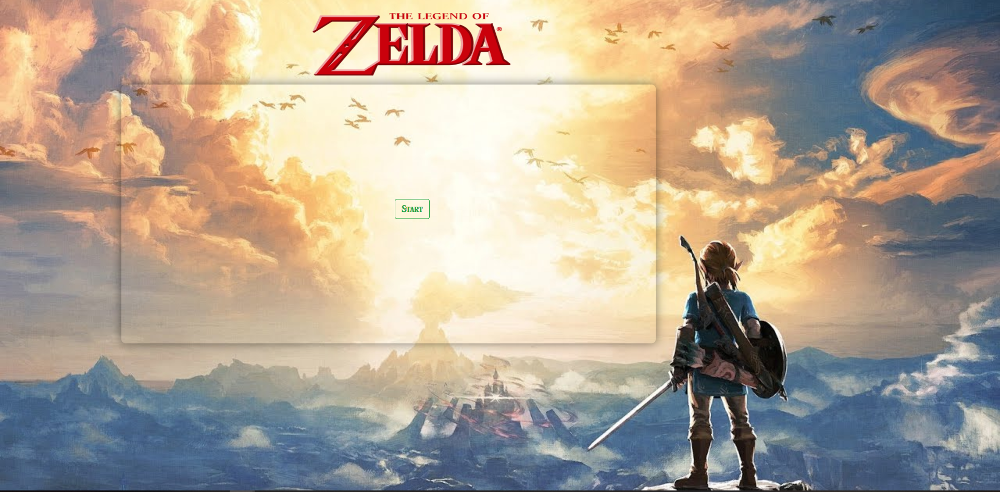

# **Zelda Trivia**
Demonstrate you Zelda Knowlede by playing Zelda Trivia!  
## **Overview**
This is a basic trivia game based off of the Nintendo Zelda video games.  The game is started when the user presses the start button.  The user has 30 seconds to pick an answer.  A right anwswer will show a right answer screen with a gif, a wrong answer will show a wrong answer screen with the right answer and a gif, and if no answer if choosen then there will be a similar screen to the wrong answer screen that will show up.  Once all of the questions are answered, a result screen will show with the results of right answered, wrong answered, and not answered. 

## **Link To App**
https://blnicholson.github.io/TriviaGame
## **Technical Information**
This app was created by using the following:

* JavaScript
* HTML
* CSS
* jQuery

## **Game Images**

